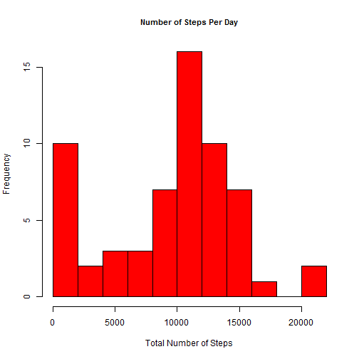
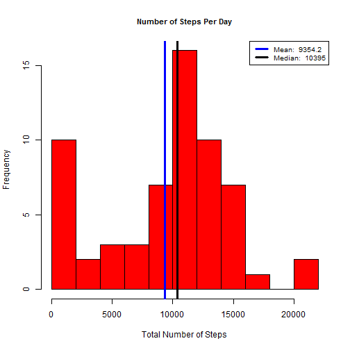
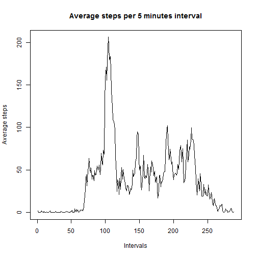
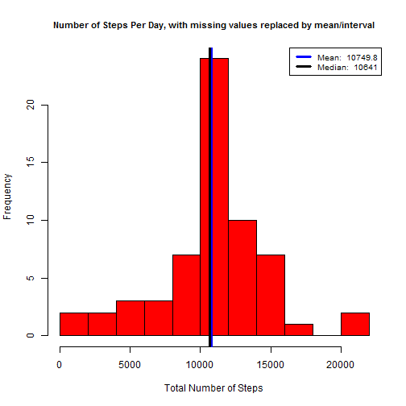
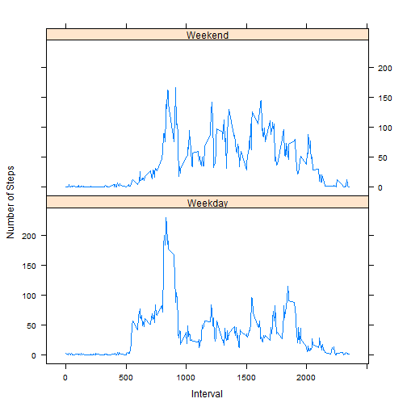

### Introduction
This document contains analysis of personal activity data collected from a device. The data have been collected from an anonymous individual during the months of October and November, 2012 and include the number of steps taken in 5 minute intervals each day. The dataset has been downloaded from <https://d396qusza40orc.cloudfront.net/repdata%2Fdata%2Factivity.zip> the 18 of September 2015. 

###Loading and processing the data. I changed the type of the date variable.

```r
data <- read.csv("activity.csv", sep=",", stringsAsFactors=FALSE)
library(dplyr)
data<-mutate(data, date=as.Date(date))
```
###The mean total number of steps taken per day. The missing values are ignored in this part
####The total number of steps taken per day.

```r
library(data.table)
tdata<-data.table(data)
stepsperday<-tdata[, list(sumsteps=sum(steps, na.rm=TRUE)), by = date]
stepsperday
```

```
##           date sumsteps
##  1: 2012-10-01        0
##  2: 2012-10-02      126
##  3: 2012-10-03    11352
##  4: 2012-10-04    12116
##  5: 2012-10-05    13294
##  6: 2012-10-06    15420
##  7: 2012-10-07    11015
##  8: 2012-10-08        0
##  9: 2012-10-09    12811
## 10: 2012-10-10     9900
## 11: 2012-10-11    10304
## 12: 2012-10-12    17382
## 13: 2012-10-13    12426
## 14: 2012-10-14    15098
## 15: 2012-10-15    10139
## 16: 2012-10-16    15084
## 17: 2012-10-17    13452
## 18: 2012-10-18    10056
## 19: 2012-10-19    11829
## 20: 2012-10-20    10395
## 21: 2012-10-21     8821
## 22: 2012-10-22    13460
## 23: 2012-10-23     8918
## 24: 2012-10-24     8355
## 25: 2012-10-25     2492
## 26: 2012-10-26     6778
## 27: 2012-10-27    10119
## 28: 2012-10-28    11458
## 29: 2012-10-29     5018
## 30: 2012-10-30     9819
## 31: 2012-10-31    15414
## 32: 2012-11-01        0
## 33: 2012-11-02    10600
## 34: 2012-11-03    10571
## 35: 2012-11-04        0
## 36: 2012-11-05    10439
## 37: 2012-11-06     8334
## 38: 2012-11-07    12883
## 39: 2012-11-08     3219
## 40: 2012-11-09        0
## 41: 2012-11-10        0
## 42: 2012-11-11    12608
## 43: 2012-11-12    10765
## 44: 2012-11-13     7336
## 45: 2012-11-14        0
## 46: 2012-11-15       41
## 47: 2012-11-16     5441
## 48: 2012-11-17    14339
## 49: 2012-11-18    15110
## 50: 2012-11-19     8841
## 51: 2012-11-20     4472
## 52: 2012-11-21    12787
## 53: 2012-11-22    20427
## 54: 2012-11-23    21194
## 55: 2012-11-24    14478
## 56: 2012-11-25    11834
## 57: 2012-11-26    11162
## 58: 2012-11-27    13646
## 59: 2012-11-28    10183
## 60: 2012-11-29     7047
## 61: 2012-11-30        0
##           date sumsteps
```


####Histogram of the total number of steps taken each day. We can notice that the histogram confirms the values in the previous table: only 2 days report more than 20000 steps in total.

```r
hist(stepsperday$sumsteps, breaks=15, main = "Number of Steps Per Day", xlab = "Total Number of Steps", col = 'red', cex.main = .9)
```

 
####Calculating and reporting the mean and median of the total number of steps taken per day

```r
hist(stepsperday$sumsteps, breaks=15, main = "Number of Steps Per Day", xlab = "Total Number of Steps", col = 'red', cex.main = .9)
#Mean and median
meansteps = round(mean(stepsperday$sumsteps), 1)
mediansteps = round(median(stepsperday$sumsteps), 1)
#Reporting lines for mean and median on the histogram
abline(v=meansteps, lwd = 3, col = 'blue')
abline(v=mediansteps, lwd = 3, col = 'black')
#Legend
legend('topright', lty = 1, lwd = 3, col = c("blue", "black"),
      cex = .8, 
      legend = c(paste('Mean: ', meansteps),
      paste('Median: ', mediansteps))
      )
```

 

###The average daily activity pattern
####Ploting the average steps per 5 minutes interval

```r
stepsperInterv<-tdata[, list(avsteps=mean(steps, na.rm=TRUE)), by = interval]
with(stepsperInterv, {
  plot(avsteps, type="l", main="Average steps per 5 minutes interval", xlab="Intervals", ylab="Average steps")
})
```

 
####The interval with the maximum steps is:


```r
max_steps = stepsperInterv[which.max(avsteps), ]
max_steps
```

```
##    interval  avsteps
## 1:      835 206.1698
```
###Imputing missing values
####Total number of missing values in the dataset

```r
nbMissing = sum(is.na(data$steps))
nbMissing
```

```
## [1] 2304
```
####Filling in all of the missing values in the dataset: I decided to fill the missing values with the mean for the related interval. I use the floor function to round the means towards zero to avoid using fractional steps.


```r
stepsperInterv$avsteps <- floor(stepsperInterv$avsteps)
# Merge the original data with the one with average steps per interval based on the intervals
setkey(stepsperInterv, "interval")
setkey(tdata, "interval")


#Create function that will return the second value if the first value is missing
replace = function(x,y){
        if(is.na(x)){

                return(y)
        }
        return(x)
}

#create new dataset that replaces missing values with average values
imputed_activity = tdata[stepsperInterv]
imputed_activity$new_steps = mapply(replace,imputed_activity$steps, imputed_activity$avsteps)

#summaryize new dataset by day
withMissingStepsperday = imputed_activity[, list(new_steps = sum(new_steps, na.rm = TRUE)), 
                          by = date]

#preview new dataset
head(withMissingStepsperday)
```

```
##          date new_steps
## 1: 2012-10-01     10641
## 2: 2012-10-02       126
## 3: 2012-10-03     11352
## 4: 2012-10-04     12116
## 5: 2012-10-05     13294
## 6: 2012-10-06     15420
```

```r
#histogram of the total number of steps taken each day
hist(withMissingStepsperday$new_steps, breaks=15, main = "Number of Steps Per Day, with missing values replaced by mean/interval", xlab = "Total Number of Steps", col = 'red', cex.main = .9)
#Mean and median
meansteps = round(mean(withMissingStepsperday$new_steps), 1)
mediansteps = round(median(withMissingStepsperday$new_steps), 1)
#Reporting lines for mean and median on the histogram
abline(v=meansteps, lwd = 3, col = 'blue')
abline(v=mediansteps, lwd = 3, col = 'black')
#Legend
legend('topright', lty = 1, lwd = 3, col = c("blue", "black"),
      cex = .8, 
      legend = c(paste('Mean: ', meansteps),
      paste('Median: ', mediansteps))
      )
```

 
#####We can see that the values of the mean and median are now close.

###Comparing activity patterns of weekdays and weekends


```r
#Make Function To Return Either "Weekday" or "Weekend". The weekdays functions returns days in french on my computer. You may want to change to saturday and sunday if you are using an english config.
fdaytype = function(x){
        if(x %in% c('samedi', 'dimanche')){
                return('Weekend')
        }

        return('Weekday')
}
#New factor variable in the dataset with two levels - "weekday" and "weekend" indicating whether a given date is a weekday or weekend day
imputed_activity$dayname = weekdays(as.Date(imputed_activity$date))
imputed_activity$daytype = as.factor(apply(as.matrix(imputed_activity$dayname), 1, fdaytype))
##Summarize Dataset: Mean grouped by interval and daytype
sum_imputed_activity = imputed_activity[, list(avsteps = mean(new_steps, na.rm = TRUE)), by = list(interval, daytype)]

#Inspect the data
str(sum_imputed_activity)
```

```
## Classes 'data.table' and 'data.frame':	576 obs. of  3 variables:
##  $ interval: int  0 0 5 5 10 10 15 15 20 20 ...
##  $ daytype : Factor w/ 2 levels "Weekday","Weekend": 1 2 1 2 1 2 1 2 1 2 ...
##  $ avsteps : num  2.156 0.125 0.4 0 0.156 ...
##  - attr(*, ".internal.selfref")=<externalptr>
```

```r
#Panel plot containing a time series plot of the 5-minute interval x axis and the average number of steps taken, averaged across all weekday days or weekend days y axis
library(lattice)
xyplot(avsteps~interval | daytype, data = sum_imputed_activity,
      type = 'l',
      xlab = 'Interval',
      ylab = 'Number of Steps',
      layout = c(1,2))
```

 


